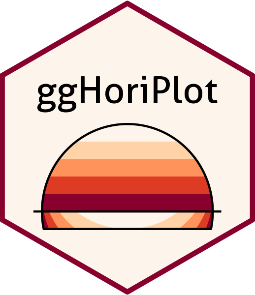

```{r, echo = FALSE}
knitr::opts_chunk$set(
  collapse = TRUE,
  comment = "#>",
  fig.path = "man/figures/"
)
```

# ggHoriPlot: build horizon plots in ggplot2 


<!-- badges: start -->
[](https://github.com/rivasiker/ggHoriPlot/actions/workflows/check-standard.yaml)
[](https://cran.r-project.org/web/packages/ggHoriPlot/index.html)
[](https://cran.r-project.org/web/packages/ggHoriPlot/index.html)
[](https://codecov.io/gh/rivasiker/ggHoriPlot)
<!-- badges: end -->

This package allows building horizon plots in ggplot2. You can learn more about the package in `vignette("ggHoriPlot")`.

## Installation

You can install `ggHoriPlot` from CRAN via:

``` r
install.packages("ggHoriPlot")
```

You can also install the development version of the package from GitHub with the following command:

``` r
#install.packages("devtools")
devtools::install_github("rivasiker/ggHoriPlot")
```

## Basic example

Load the libraries:

```{r libraries, warning=FALSE, message=FALSE}
library(tidyverse)
library(ggHoriPlot) 
library(ggthemes)

```

Load the dataset and calculate the cutpoints and origin:

```{r set}
utils::data(climate_CPH)

cutpoints <- climate_CPH  %>% 
  mutate(
    outlier = between(
      AvgTemperature, 
      quantile(AvgTemperature, 0.25, na.rm=T)-
        1.5*IQR(AvgTemperature, na.rm=T),
      quantile(AvgTemperature, 0.75, na.rm=T)+
        1.5*IQR(AvgTemperature, na.rm=T))) %>% 
  filter(outlier)

ori <- sum(range(cutpoints$AvgTemperature))/2
sca <- seq(range(cutpoints$AvgTemperature)[1], 
           range(cutpoints$AvgTemperature)[2], 
           length.out = 7)[-4]

round(ori, 2) # The origin

round(sca, 2) # The horizon scale cutpoints

```

Build the horizon plots in `ggplot2` using `geom_horizon()`:

```{r CPH_climate}
climate_CPH %>% ggplot() +
  geom_horizon(aes(date_mine, 
                   AvgTemperature,
                   fill = ..Cutpoints..), 
               origin = ori, horizonscale = sca) +
  scale_fill_hcl(palette = 'RdBu', reverse = T) +
  facet_grid(Year~.) +
  theme_few() +
  theme(
    panel.spacing.y=unit(0, "lines"),
    strip.text.y = element_text(size = 7, angle = 0, hjust = 0),
    axis.text.y = element_blank(),
    axis.title.y = element_blank(),
    axis.ticks.y = element_blank(),
    panel.border = element_blank()
    ) +
  scale_x_date(expand=c(0,0), 
               date_breaks = "1 month", 
               date_labels = "%b") +
  xlab('Date') +
  ggtitle('Average daily temperature in Copenhagen', 
          'from 1995 to 2019')

```

## Learn more

You can check out the full functionality of `ggHoriPlot` in the following guides:

  - [Getting started](https://rivasiker.github.io/ggHoriPlot/articles/ggHoriPlot.html)
  - [Examples with real data](https://rivasiker.github.io/ggHoriPlot/articles/examples.html)

